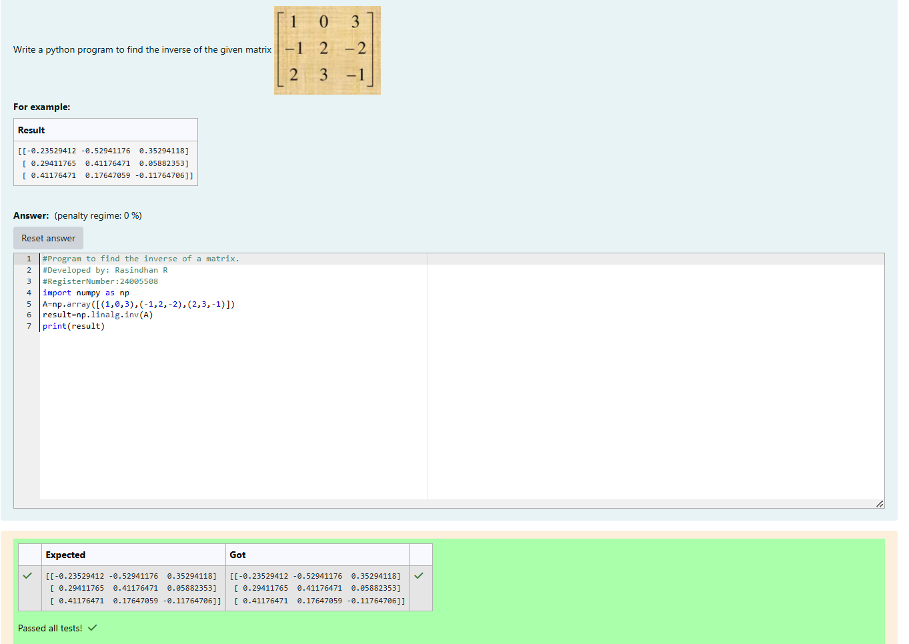

# INVERSE-OF-A-MATRIX
## Aim:
To write a python program to find the inverse of a matrix
## Equipment’s required:
1. 	Hardware – PCs
2. 	Anaconda – Python 3.7 Installation / Moodle-Code Runner
## Algorithm:
### Step1 : Input Matrix A (square matrix).
### Step 2: Check: Compute the determinant of A.f it is zero,print that the matrix is non-invertible and stop.
### Step 3: Compute: If the determinant is non-zero,use np.linalg.inv(A) to compute the inverse.
### Step 4: Output: Print the inverse matrix.
## Program:
```
#Program to find the inverse of a matrix.
#Developed by: Rasindhan R
#RegisterNumber:24005508
import numpy as np
A=np.array([(1,0,3),(-1,2,-2),(2,3,-1)])
result=np.linalg.inv(A)
print(result)
```
## Output:

## Result:
Thus the inverse of given matrix is successfully solved using python program

